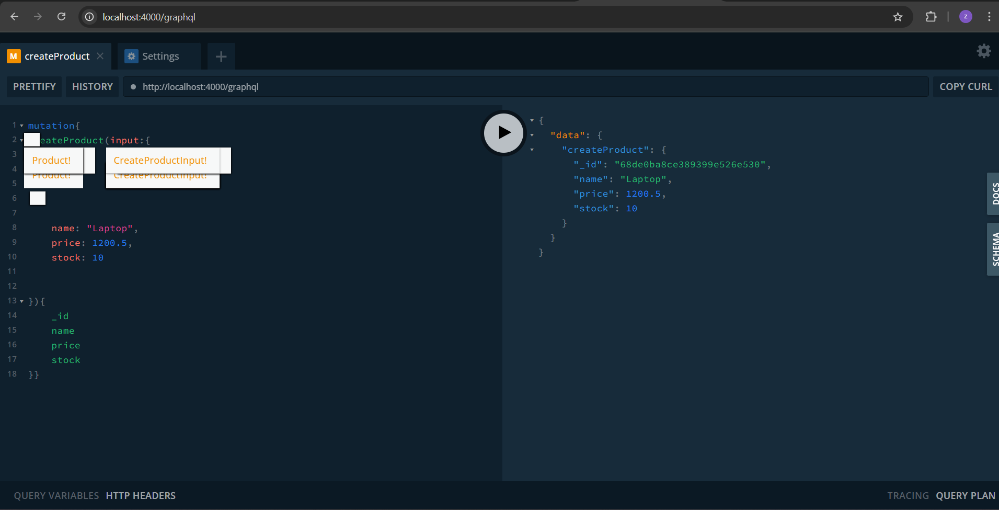
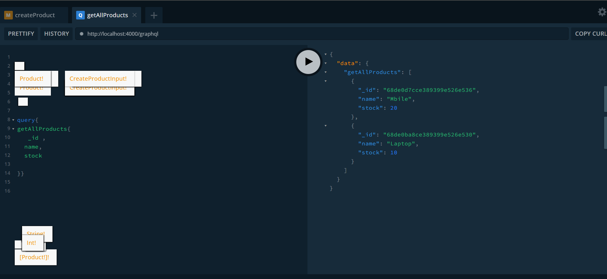
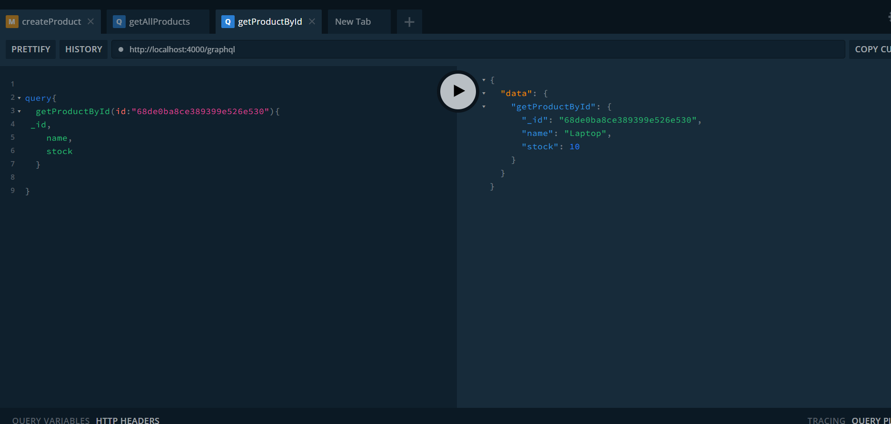
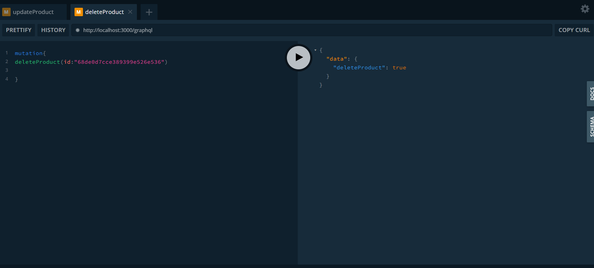

---

# NestJS GraphQL Product CRUD API

A simple GraphQL API built with NestJS, Mongoose, and MongoDB to manage products (create, read, update, delete).

---

## 📂 Project Structure

```
nestjs-graphql-product-crud/
│
├── src/
│   ├── product/
│   │   ├── dto/
│   │   │   ├── create-product.input.ts
│   │   │   └── update-product.input.ts
│   │   ├── product.model.ts
│   │   ├── product.schema.ts
│   │   ├── product.service.ts
│   │   └── product.resolver.ts
│   │
│   ├── app.module.ts
│   └── main.ts
│
├── .env
├── package.json
└── README.md
```

---

## ⚡ Features

* Create a product
* Get all products
* Get a product by ID
* Update a product
* Delete a product
* Auto-generated GraphQL schema
* MongoDB integration with Mongoose

---

## 🛠️ Installation

```bash
# Clone the repo
git clone https://github.com/beingzuhairkhan/CRUD_Nest_With_GraphQL.git


# Install dependencies
npm install

# Start the server
npm run start:dev
```

---

## 🌐 Environment Variables (`.env`)

```env
MONGO_URI=mongodb://localhost:27017/nestgraphql
PORT=3000
```

---

## 📌 GraphQL API

**GraphQL Playground / Apollo Sandbox:**
Open in browser: `http://localhost:3000/graphql`









